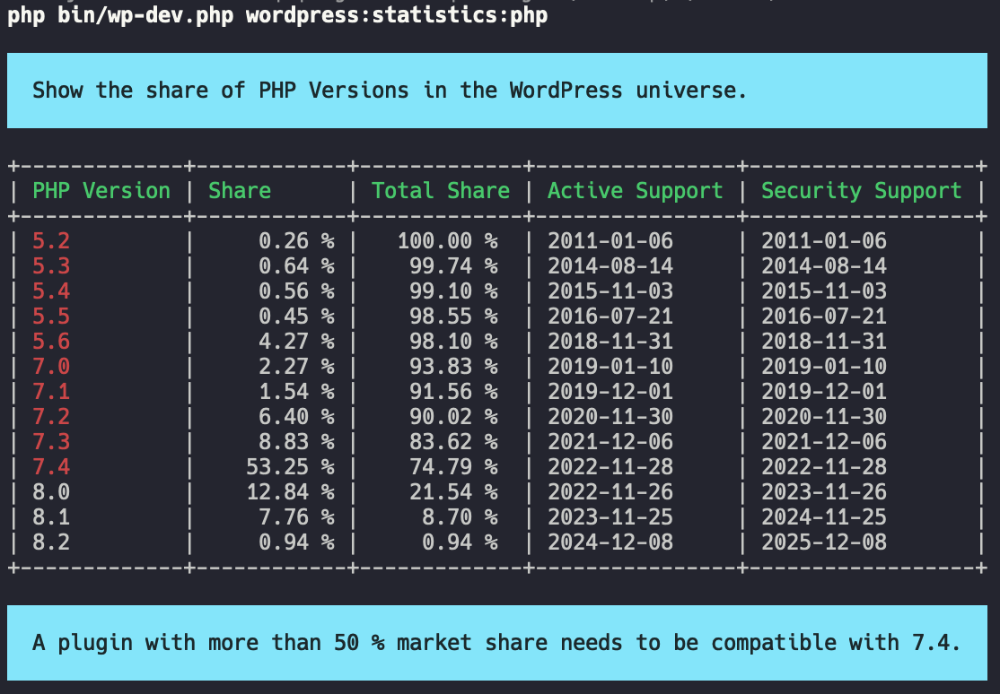

This "Developer CLI for WordPress" extension includes a number of statistics about the WordPress universe. All WordPress numbers come from the official WordPress source.

## `wordpress:statistics:wordpress`

Shows the current usage and share of the WordPress versions that are installed.

## `wordpress:statistics:php`

Shows the current usage and share of the PHP versions that are installed.

We enrich the data with the support dates of the PHP versions. Versions shown in red are already out of support. This can be super dangerous as no sucurity updates will be provided.

## `wordpress:statistics:mysql`

Shows the current usage and share of the MySQL versions that are installed.

## `wordpress:statistics:locale`

Shows the current usage of the different locales that are available in WordPress.
